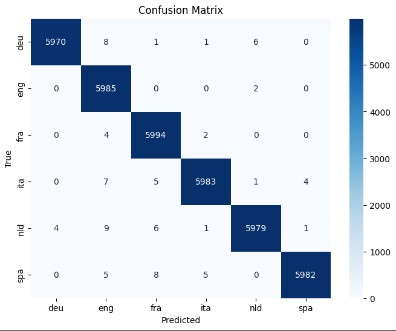
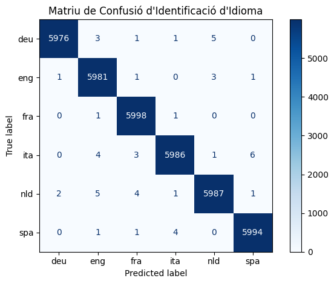

<style>
/* Estils globals del document */
body {
  font-family: Helvetica, Arial, sans-serif;
  font-size: 9pt;
  text-align: justify;
  line-height: 1.4;
  margin: 0.5cm;  /* Marges generals del body reduïts */
}

/* Paràgrafs justificats */
p {
  text-align: justify;
  font-size: 9pt;
  margin: 0.3rem 0;  /* Marges verticals reduïts */
}

/* Estils per a les llistes amb la mateixa mida que el text normal */
ul, ol, code {
  font-size: 9pt;
  line-height: 1.4;
  margin: 0.3rem 0;  /* Marges verticals reduïts */
}

li {
  font-size: 9pt;
  line-height: 1.4;
  margin: 0.2rem 0;  /* Marges entre elements de llista reduïts */
}

/* Títols més petits */
h1 {
  font-size: 13pt;
  text-align: left;
  margin: 0.5rem 0 0.4rem 0;  /* Marges reduïts */
}

h2 {
  font-size: 12pt;
  text-align: left;
  font-weight: bold;
  margin: 0.4rem 0 0.3rem 0;  /* Marges reduïts */
}

h3 {
  font-size: 11pt;
  text-align: left;
  font-weight: bold;
  margin: 0.3rem 0 0.3rem 0;  /* Marges reduïts */
}

h4 {
  font-size: 9pt;
  text-align: left;
  margin: 0.3rem 0 0.2rem 0;  /* Marges reduïts */
}

h5{
  font-size: 9pt;
  text-align: left;
  text-decoration: underline;
  margin: 0.3rem 0 0.2rem 0;  /* Marges reduïts */
}

/* CORRECCIONS PER A BLOCS DE CODI */
pre {
  max-width: 100%;
  overflow-x: auto;
  white-space: pre-wrap;
  word-wrap: break-word;
  overflow-wrap: break-word;
  background-color: #f5f5f5;
  padding: 0.3rem;  /* Padding reduït */
  border: 1px solid #ddd;
  border-radius: 3px;
  font-size: 8pt;
  line-height: 1.4;
  min-width: 0;
  margin: 0.5rem 0;  /* Marges verticals reduïts */
}

code {
  overflow-wrap: break-word;
  word-wrap: break-word;
  word-break: break-word;
  white-space: pre-wrap;
}

/* Contenidor principal */
.image-row {
  display: flex;
  flex-wrap: wrap;
  justify-content: center;
  gap: 0.6rem;       /* Espai entre imatges reduït */
  margin-top: 0.6rem;  /* Marges reduïts */
  margin-bottom: 0.6rem;
  align-items: flex-start;
  width: 100%;
}

/* MODIFICAT: Reduïm la base (flex-basis) a 180px perquè hi capiguin 3 en una fila */
.image-column {
  flex: 1 1 180px;
  max-width: 320px;
  display: flex;
  flex-direction: column;
  align-items: center;
  box-sizing: border-box;
}

/* Regla específica: Si només hi ha UNA imatge, la deixem ser més gran */
.image-row:has(.image-column:only-child) .image-column {
  max-width: 480px;
  flex: 0 1 auto;
}

/* Imatges */
.image-column img {
  width: 100%;
  max-height: 280px;
  height: auto;
  display: block;
  object-fit: contain;
}

/* Peu de foto */
.image-column .caption {
  margin-top: 0.3rem;  /* Marge reduït */
  font-size: 8pt;
  text-align: center;
  color: #555;
  width: 100%;
}

/* ============================================
    CONTENIDOR GRID 2x2 PER A IMATGES
    ============================================ */
.image-grid {
  display: grid;
  grid-template-columns: repeat(2, 1fr);
  gap: 0.5rem;  /* Espai entre elements reduït */
  margin-top: 0.6rem;  /* Marges reduïts */
  margin-bottom: 0.6rem;
  width: 100%;
  max-width: 720px;
  margin-left: auto;
  margin-right: auto;
}

/* Cada cel·la del grid */
.image-grid .grid-item {
  display: flex;
  flex-direction: column;
  align-items: center;
  box-sizing: border-box;
}

/* Imatges dins del grid 2x2 */
.image-grid .grid-item img {
  width: 100%;
  max-width: 360px;
  max-height: 320px;
  height: auto;
  display: block;
  object-fit: contain;
}

/* Peu de foto per a cada imatge del grid */
.image-grid .grid-item .caption {
  margin-top: 0.3rem;  /* Marge reduït */
  font-size: 8pt;
  text-align: center;
  color: #555;
  width: 100%;
}

/* Peu de figura general (opcional, per sota de tot el grid) */
.image-grid-caption {
  margin-top: 0.5rem;  /* Marge reduït */
  font-size: 8pt;
  text-align: center;
  color: #555;
  font-style: italic;
}

/* Estil per a la separació de pàgines en PDF */
.page-break {
  page-break-before: always;
  break-before: page;
}

/* Bloc imatge-esquerra / text-dreta */
.media-row {
  display: flex;
  gap: 1rem;  /* Espai reduït */
  align-items: flex-start;
  margin: 0.6rem 0;  /* Marges reduïts */
  min-width: 0;
}

.media-image {
  flex: 0 0 38%;
  max-width: 240px;
  display: flex;
  flex-direction: column;
  align-items: center;
}

.media-image img {
  width: 100%;
  height: auto;
  display: block;
}

.media-image .caption {
  margin-top: 0.3rem;  /* Marge reduït */
  font-size: 8pt;
  text-align: center;
  color: #555;
}

.media-text {
  flex: 1 1 0;
  min-width: 240px;
}

/* ============================================
    CONTENIDOR DE TAULES AMB PEU DE TAULA
    ============================================ */
.table-container {
  width: 100%;
  margin: 0.8rem 0;  /* Marges reduïts */
  overflow-x: auto;
  page-break-inside: avoid;
}

/* Estils per a les taules */
.table-container table {
  width: 100%;
  max-width: 100%;
  border-collapse: collapse;
  font-size: 7pt;
  margin: 0 auto;
  background-color: #fff;
}

/* Capçalera de taula */
.table-container thead {
  background-color: #e0e0e0;
  font-weight: bold;
}

.table-container th {
  padding: 6px 4px;  /* Padding reduït */
  text-align: center;
  border: 1px solid #888;
  font-size: 7pt;
}

/* Files de dades */
.table-container td {
  padding: 5px 4px;  /* Padding reduït */
  text-align: center;
  border: 1px solid #aaa;
  font-size: 7pt;
}

.table-container td code {
  font-size: 7pt;
}

/* Files alternades (zebra striping) */
.table-container tbody tr:nth-child(even) {
  background-color: #f5f5f5;
}

/* Peu de taula (caption) */
.table-container .table-caption {
  margin-top: 0.4rem;  /* Marge reduït */
  font-size: 8pt;
  text-align: center;
  color: #555;
  font-style: italic;
}

/* Estil alternatiu: caption sobre la taula */
.table-container .table-title {
  margin-bottom: 0.4rem;  /* Marge reduït */
  font-size: 9pt;
  text-align: center;
  font-weight: bold;
  color: #333;
}

/* Millores per a impressió/PDF */
@media print {
  body {
    margin: 1cm 1.2cm;  /* Marges de pàgina més petits per a PDF */
  }

  .table-container {
    page-break-inside: avoid;
  }

  .table-container table {
    border: 1px solid #000;
  }

  .table-container th,
  .table-container td {
    border: 1px solid #666;
  }

  .image-column {
    page-break-inside: avoid;
  }

  /* Límits més restrictius per a PDF */
  .image-column img {
    max-height: 280px;
  }

  .image-row:has(.image-column:only-child) .image-column img {
    max-height: 360px;
  }

  /* Grid 2x2 en impressió */
  .image-grid {
    page-break-inside: avoid;
  }

  .image-grid .grid-item img {
    max-height: 280px;
  }

  pre {
    page-break-inside: avoid;
    overflow: visible;
    white-space: pre-wrap;
  }
}

@page {
  margin: 2.54cm 1cm;  
  @bottom-center {
    content: "Pàgina " counter(page) " de " counter(pages);
    font-size: 8pt;
    color: #555;
    font-family: Helvetica, Arial, sans-serif;
  }
}
</style>

## 0. Taula de Continguts

- [0. Taula de Continguts](#0-taula-de-continguts)
- [1. Introducció](#1-introducció)
- [2. Dades del problema](#2-dades-del-problema)
- [3. Preprocessament](#3-preprocessament)
- [4. Implementació dels models](#4-implementació-dels-models)
  - [4.1 Lidstone Smoothing](#41-lidstone-smoothing)
    - [4.1.1 Implementació](#411-implementació)
    - [4.1.2 Refinament del paràmetre $\\lambda$](#412-refinament-del-paràmetre-lambda)
    - [4.1.3 Anàlisi dels resultats i errors](#413-anàlisi-dels-resultats-i-errors)

## 1. Introducció

## 2. Dades del problema

## 3. Preprocessament

Per a preprocessar, agafem el contingut original de cada document de text i se sotmet a un rentat de cara per uniformar-lo. Això implica treure tots els números, convertir totes les lletres a minúscules i endreçar els espais perquè no n'hi hagi de sobrers entre paraules o al principi i al final del text. A més, s'aprofita per estandarditzar la separació entre les frases, canviant els salts de línia convencionals per un format específic, un doble espai, que facilita el seu tractament posterior. Això es fa així perquè el model que es construirà més endavant treballarà amb trigrames, i aquesta forma de separar les frases permet que els trigrames no es vegin afectats per espais innecessaris, mantenint la coherència en l'anàlisi de les seqüències de caràcters.

Un cop els textos estan nets, comença la segona fase, que consisteix a repartir el material perquè el model pugui aprendre i, posteriorment, ser examinat. Per fer-ho de manera justa i representativa, el codi agafa totes les frases de cada idioma del conjunt de train, les remena a l'atzar i les talla en dos blocs: un gran que conté el vuitanta per cent de la informació i un de més petit amb el vint per cent restant. Això és així perquè en el conjunt de dades donat originalment, les dades del test estavem presents al 100% en el conjunt d'entrenament donat. Doncs per evitar que el model aprengui a reconèixer les frases del test, es fa aquesta divisió, de manera que el model només veu el bloc gran durant l'entrenament i el bloc petit es reserva per avaluar la seva capacitat de generalització.

## 4. Implementació dels models

### 4.1 Lidstone Smoothing

El Lidstone Smoothing és una tècnica d'estimació de probabilitats que s'utilitza per evitar problemes de zero probabilitat en models de llenguatge. Aquesta tècnica consisteix a afegir un petit valor, anomenat $\lambda$, a les freqüències observades dels trigrames, assegurant que cap trigram no tingui una probabilitat de zero, fins i tot si no s'ha observat en el conjunt d'entrenament. Això permet que el model pugui generalitzar millor a dades noves i desconegudes, millorant així la seva capacitat de predicció.

#### 4.1.1 Implementació

A la fase d'entrenament, el model calcula les freqüències dels trigrames per a cada idioma, així com els paràmetres $B$ (nombre total de trigrames únics) i $N_t$ (nombre total de trigrames observats), i guardem en un arxiu `.json` juntament amb el valor de $\lambda$ utilitzat, que per defecte és 0.5. Aquesta informació és essencial per a la fase de predicció, on el model utilitza aquestes freqüències i paràmetres per calcular les probabilitats dels trigrames en els documents de test i determinar a quin idioma pertanyen. Un cop entrenat, el model es pot carregar des d'aquest arxiu `.json` per a realitzar les prediccions sense necessitat de tornar a entrenar-lo, facilitant així la seva reutilització i aplicació en diferents conjunts de dades.

La inferència es realitza, donat un text, dividint-lo en trigrames i calculant la probabilitat de cada trigram per a cada idioma utilitzant la fórmula del Lidstone Smoothing, que incorpora el valor de $\lambda$ per ajustar les freqüències observades. Per tant, utlitzant les freqüències dels trigrames i els paràmetres $B$ i $N_{t}$ calculats durant l'entrenament, el model calcula la probabilitat de cada trigram per a cada idioma i, finalment, multiplica aquestes probabilitats per obtenir la probabilitat total del document per a cada idioma, o equivalentment, suma els logaritmes de les probabilitats per eficiència computacional:

$$
P^T(e_j) = P^T_{\text{LID}}(e_j) = \dfrac{C_t(e_j) + \lambda}{N_t + \lambda B}
$$

On, per MLE:

$$
P(\hat{d}) = P(e_1, \ldots, e_s) = \prod_{j=1}^{s} P(e_j)
$$

O equivalentment, en termes de logaritmes:

$$
\log P(\hat{d}) = \sum_{j=1}^{s} \log P(e_j)
$$

El model selecciona l'idioma que té la probabilitat més alta com a predicció final per al document de test. Per tal d'anar més enllà i refinar el valor de $\lambda$, es realitza una validació creuada, on el conjunt d'entrenament es divideix en sub-conjunts i el model es prova amb diferents valors de $\lambda$ per determinar quin proporciona la millor precisió (accuracy) en els conjunts de validació. Aquesta etapa és crucial per optimitzar el rendiment del model i assegurar que no s'està sobreajustant als dades d'entrenament, permetent així una millor generalització a dades noves. Es proven diferents lambdes que van del 0.01 al 1, i es selecciona aquell que maximitza l'accuracy del model en els conjunts de validació, per cada idioma.

En termes de codi, el model es defineix com una classe `LanguageDetector`, que inclou els següents mètodes:

- `__init__`: Inicialitza el model amb un valor de $\lambda$, que per defecte és 0.5.
- `fit`: Entrena el model amb les dades d'entrenament, calculant els trigrames i les seves freqüències, així com els paràmetres $B$ i $N_t$. Retorna un arxiu `.json` amb els paràmetres del model.
- `load_model`: Carrega un model preentrenat des d'un fitxer `.json`.
- `predict_text`: Realitza la predicció de l'idioma d'un frase donada, calculant les probabilitats dels trigrames i seleccionant l'idioma amb la probabilitat més alta.
- `refining_lambda`: Realitza una validació creuada per a refinar el valor de $\lambda$, provant diferents valors i seleccionant aquell que maximitza l'accuracy del model. Aquest mètode sobreescriu el valor de $\lambda$ del model amb el valor optimitzat.
- `evaluate_model`: Avalua el rendiment del model amb les dades de test, calculant l'accuracy i la matriu de confusió.

#### 4.1.2 Refinament del paràmetre $\lambda$

Un cop implementat el model amb Lidstone Smoothing, es procedeix a refinar el paràmetre $\lambda$ per optimitzar el rendiment del model. Aquesta etapa és crucial perquè el valor de $\lambda$ afecta directament la suavització de les probabilitats dels trigrames i, per tant, la capacitat del model per generalitzar a dades noves. Aquí tens l'explicació ampliada, conservant el to tècnic i aprofundint en els passos clau de l'algorisme i els mecanismes d'avaluació. Entrem en detall de com funciona aquest mètode.

El mètode comença llegint el diccionari de freqüències que ja ha generat la fase de `fit` (on cada clau és un trigrama i el valor n'és la freqüència absoluta). Com que per fer la validació creuada necessitem fer particions, el mètode "descomprimeix" o aplana aquest diccionari en una única llista on els trigrames es repeteixen tantes vegades com indica el seu compte. D'aquesta manera, mantenim la distribució estadística real del corpus original de cada idioma. A continuació, remena (*shuffle*) la llista de manera aleatòria i la divideix en $k$ parts iguals (per defecte 4). Això permet estructurar un procés iteratiu on, a cada pas, es fa servir un bloc diferent com a conjunt de validació ($25\%$ de les dades) mentre s'entrena el model amb la resta dels blocs sumats (el $75\%$ de les dades restants).
L'aportació més rellevant d'aquest mètode és la seva avaluació. Per a cada un dels candidats d'hiperparàmetres establerts a `lambdas_to_test` ($0.001, 0.01, \dots$), el codi prova a avaluar **individualment** cada trigrama de la partició de validació com si es tractés d'un minúscul text desconegut. S'extreu la probabilitat logarítmica d'aquest trigrama concret utilitzant el diccionari generat al *train fold* combinat amb el valor del $\lambda$ candidat actual (ja sigui atorgant probabilitat clàssica a trigrames coneguts, o aplicant l'atenuació logarítmica extrema als desconeguts, també anomenats casos *Out Of Vocabulary*).

No obstant això, mesurar únicament la probabilitat interna d'un idioma no ens diu fins a quin punt l'algoritme de predicció funciona bé realment; ens interessa una mètrica de precisió objectiva (Accuracy). Per això, per al trigrama que s'està avaluant en aquell moment precís, l'algorisme inspecciona iterativament els paràmetres de **tots els altres idiomes presents al JSON original**, i calcula la puntuació que ells (amb les seves configuracions constants i globals) li assignarien. Només si l'idioma original assoleix una probabilitat de pertinença **estrictament superior** (el resultat logarítmic és menys negatiu) a les probabilitats obtingudes amb els altres idiomes, es comptabilitza un encert (`correct_predictions += 1`). Finalitzats els $k$ cicles d'entrenament i validació per al candidat $\lambda$, es calcula la mitjana global d'aquestes exactituds creuades, obtenint un marge de seguretat en percentatge (l'Accuracy).

Al final del bucle d'avaluació de la llista de candidats, la funció compara el rendiment numèric de tots els $\lambda$ avaluats, seleccionant el que hagi aportat l'Accuracy mitjana més elevada. Si detecta millores amb el nou hiperparàmetre respecte del que tenia anteriorment, la propietat `self.model_params` s'actualitza i el codi obre de nou el fitxer original passat per argument, sobreescrivint el seu contingut per desar de manera permanent aquest "tunning" intern.
Els resultats d'aquest procés es poden observar a la taula següent, on es mostren els valors de $\lambda$ provats i les seves corresponents precisions (Accuracy) obtingudes a través de la validació creuada:

<div class="table-container">
  <div class="table-title">Resultats del Refinament del Paràmetre Lambda per Idioma</div>
  <table>
    <thead>
      <tr>
        <th>Idioma</th>
        <th>λ = 0.001</th>
        <th>λ = 0.01</th>
        <th>λ = 0.05</th>
        <th>λ = 0.1</th>
        <th>λ = 0.3</th>
        <th>λ = 0.5</th>
        <th>λ = 0.7</th>
        <th>λ = 1.0</th>
      </tr>
    </thead>
    <tbody>
      <tr>
        <td><strong>deu</strong></td>
        <td>50.90%</td>
        <td>50.90%</td>
        <td style="background-color: #cce5ff; font-weight: bold; border: 1px solid #888;">50.90%</td>
        <td>50.87%</td>
        <td>50.86%</td>
        <td>50.87%</td>
        <td>50.83%</td>
        <td>50.83%</td>
      </tr>
      <tr>
        <td><strong>eng</strong></td>
        <td>44.12%</td>
        <td>44.12%</td>
        <td>44.12%</td>
        <td>44.13%</td>
        <td>44.11%</td>
        <td>44.13%</td>
        <td>44.14%</td>
        <td style="background-color: #cce5ff; font-weight: bold; border: 1px solid #888;">44.15%</td>
      </tr>
      <tr>
        <td><strong>fra</strong></td>
        <td>46.61%</td>
        <td>46.61%</td>
        <td>46.61%</td>
        <td>46.60%</td>
        <td>46.61%</td>
        <td>46.59%</td>
        <td>46.60%</td>
        <td style="background-color: #cce5ff; font-weight: bold; border: 1px solid #888;">46.62%</td>
      </tr>
      <tr>
        <td><strong>ita</strong></td>
        <td>51.93%</td>
        <td>51.93%</td>
        <td>51.94%</td>
        <td>51.94%</td>
        <td style="background-color: #cce5ff; font-weight: bold; border: 1px solid #888;">51.94%</td>
        <td>51.92%</td>
        <td>51.93%</td>
        <td>51.79%</td>
      </tr>
      <tr>
        <td><strong>nld</strong></td>
        <td>49.54%</td>
        <td>49.54%</td>
        <td>49.54%</td>
        <td style="background-color: #cce5ff; font-weight: bold; border: 1px solid #888;">49.55%</td>
        <td>49.46%</td>
        <td>49.47%</td>
        <td>49.41%</td>
        <td>49.43%</td>
      </tr>
      <tr>
        <td><strong>spa</strong></td>
        <td>47.81%</td>
        <td style="background-color: #cce5ff; font-weight: bold; border: 1px solid #888;">47.81%</td>
        <td>47.80%</td>
        <td>47.80%</td>
        <td>47.79%</td>
        <td>47.79%</td>
        <td>47.79%</td>
        <td>47.74%</td>
      </tr>
    </tbody>
  </table>
  <div class="table-caption">
    Taula 1: Accuracy obtinguda durant la validació creuada per a diferents valors de λ.
  </div>
</div>

#### 4.1.3 Anàlisi dels resultats i errors

Un cop refinat el paràmetre $\lambda$ i seleccionat el valor que proporciona la millor precisió, es procedeix a avaluar el model amb les dades de test. Primer de tot observem la matriu de confusió obtinguda:

<div class="image-row">
  <div class="image-column">
    
    <div class="caption">Figura 1: Matriu de confusió del model amb Lidstone Smoothing.</div>
  </div>
</div>

El primer que destaca és la forta concentració de valors a la diagonal principal (les caselles blau fosc). Això significa que el model encerta de manera aclaparadora l'idioma correcte. Per a cada un dels 6 idiomes, el model ha avaluat 6.000 mostres (ja que la suma de cada fila és 6.000). Les xifres d'encert oscil·len entre 5.970 (alemany i neerlandès, els "pitjors") i 5.994 (francès, el millor), cosa que suposa una exactitud per a cada idioma de:

- Alemany (`deu`): 99.73%
- Anglès (`eng`): 99.97%
- Francès (`fra`): 99.97%
- Italià (`ita`): 99.72%
- Neerlandès (`nld`): 99.65%
- Espanyol (`spa`): 99.70%

Aquesta diferència abismal respecte al ~50% obtingut durant el `refining_lambda` s'explica perquè ara no s'està avaluant l'idioma d'un sol trigrama aïllat (3 lletres descontextualitzades), sinó l'acumulació de probabilitats de tots els trigrames d'un text o una frase sencera, on l'estadística esdevé molt robusta. Els errors (nombres fora de la diagonal) són residuals, però permeten observar les relacions i similituds lingüístiques que confonen el model:

**La principal font d'error implica l'Anglès (`eng`):** Si mirem la columna `eng`, veiem que 8 textos alemanys, 4 francesos, 7 italians, 9 neerlandesos i 5 espanyols s'han classificat erròniament com a anglès. Això podria deure's a la presència d'anglicismes internacionals, noms propis o URL dins els textos de prova d'aquests idiomes, o bé a que el model en anglès tingui una distribució de lletres molt neutra i dominant. També podem dentar la **relació Germànica (`deu` vs `nld`):** Es noten lleugeres confusions creuades entre l'alemany i el neerlandès per la seva mateixa arrel lingüística. 4 textos neerlandesos (`nld`) s'han predit com a alemany (`deu`), i 6 textos alemanys s'han predit com a neerlandès.
Finalment podem veure la**relació Romànica:** També s'observen confusions menors entre les llengües derivades del llatí. L'espanyol i el francès es confonen mútuament 8 cops; l'espanyol i l'italià es confonen 5 i 4 cops respectivament.

Si analitzem les frases mal classificades, podem veure certs patrons en les frases que el model ha etiquetat erròniament, podem observar diferents patrons que expliquen aquestes confusions, i els hem classificat en diferents categories:

1. **Frases que contenen noms propis estrangers, respecte la frase original:**
   Aquestes frases són les més comunes de fallar, sobretot quan la llengua de la frase original no és l'anglès, ja que l'anglès és un idioma molt dominant i internacional, i molts noms propis, marques, llocs o termes tècnics són d'origen anglès. Per exemple:

   ```text
   Frase mal classificada: 'freitag, . januar kanye west und paul mccartney bringen gemeinsame single heraus kanye west rappt nun auch mit paul mccartney (archiv).' (True: deu -> Predicted: eng)
   Frase mal classificada: 'anche air france, klm, thai airways, easyjet e ryanair hanno oggi cancellato i voli.' (True: ita -> Predicted: eng)
   Frase mal classificada: 'de band bestaat uit zanger/gitarist james bagshaw, gitarist adam smith, bassist thomas warmsley en drummer samuel toms.' (True: nld -> Predicted: eng)
   Frase mal classificada: 'temas como 'tonight', 'dirty dancer', 'lloro por ti', 'scape', 'hero', 'i like it', fueron parte del repertorio musical.' (True: spa -> Predicted: eng)
   Frase mal classificada: 'de grey's anatomy à brothers sisters" - yahoo!' (True: fra -> Predicted: eng)
    ```

    Però també hi ha un cas d'una frase en anglès que conté noms propis d'origen neerlandès, i el model l'ha classificat com a neerlandès:

    ```text
    Frase mal classificada: 'strong visuals (robrecht heyvaert, cinematography) and sound (hannes de maeyer, composer; joeri verspecht, sound engineer).' (True: eng -> Predicted: nld)
    ```

2. **Frases que no queda clar quin idioma són, perquè contenen paraules molt comunes o internacionals i perquè són molt curtes:**
   Aquestes frases, a més de ser molt curtes, contenen paraules que són molt comunes en diversos idiomes o que són internacionals. Això fa que el model no tingui prou informació per distingir clarament a quin idioma pertanyen, i per tant es confonen amb l'anglès o amb altres idiomes. Per exemple:

   ```text
   Frase mal classificada: 'champions o europa league?' (True: ita -> Predicted: fra)
   Frase mal classificada: 'ja, mein onkel peter.' (True: deu -> Predicted: nld)
   Frase mal classificada: '"dal sud", dice.' (True: ita -> Predicted: spa)
   Frase mal classificada: 'assassin's creed iv (uplay-code) für , euro.' (True: deu -> Predicted: eng)
   ```

3. **Frases que contenen caràcters estrangers o símbols que no són habituals en l'idioma original:**
    Aquestes frases contenen caràcters o símbols que no són habituals en l'idioma original, com ara caràcters d'altres llengües:

    ```text
    Frase mal classificada: 'ali adnan kadhim nassir al-tameemi ( arabisch : علي عدنان كاظم ناصر التميمي) (adhamiyah, december ) - alias ali adnan - is een irakees voetballer die bij voorkeur als linksback speelt.' (True: nld -> Predicted: eng)
    Frase mal classificada: 'ю. левянт moscú, de febrero, ria novosti.' (True: spa -> Predicted: ita)
    Frase mal classificada: 'asî es, aûn nos quedan varios dîas :d.' (True: spa -> Predicted: fra)
    Frase mal classificada: 'nyborg: hvad er din foretrukne bevaringsværdige bygning i nyborg kommune?' (True: deu -> Predicted: eng)
    ```

4. **Errors del model:** Aquí en aquest cas, el model ha comès un error de classificació on queda clar en quin idioma està escrita la frase, però el model l'ha etiquetada erròniament. Per exemple:

    ```text
    Frase mal classificada: 'joder, tiene que molar mazo tener un coche que te diga "shiu shiuiuiu hola maiquel, shiuu shiuiu", pero con la voz de chiquito de la calzada.' (True: spa -> Predicted: ita)
    Frase mal classificada: 'american and iranian diplomats began meeting last week in vienna.' (True: eng -> Predicted: nld)
    Frase mal classificada: 'pilar vive a plenitud ser madre.' (True: spa -> Predicted: fra)
    Frase mal classificada: '"¡va por ti!, ¡ay, que nos la han quitao!' (True: spa -> Predicted: fra)
    Frase mal classificada: 'marzo: estalla un conflicto civil.' (True: spa -> Predicted: ita)
    Frase mal classificada: 'en fin, a ver si espabilamos ¡hombre!' (True: spa -> Predicted: fra)
    ```

    La llengua més comuna en aquests errors és el castellà, que es confon amb l'italià i el francès, probablement perquè comparteixen moltes paraules i estructures similars, i perquè el model pot tenir més dificultats per distingir-los quan les frases són curtes o contenen paraules comunes.

### 4.2 Interpolation Smoothing

El model d’Interpolation Smoothing s’ha utilitzat com una millora respecte al suavitzat de Lidstone, ja que permet combinar informació de diferents nivells de n-grams per aconseguir prediccions més estables. La idea principal d’aquest mètode és que no sempre és necessari dependre únicament de la freqüència del trigram complet, sinó que també pot ser útil considerar informació parcial quan el trigram exacte no apareix en el corpus d’entrenament.

#### 4.2.1 Implementació
En concret, la probabilitat d’un trigram es calcula com una combinació lineal de quatre components diferents: la probabilitat del trigram complet, la del bigram associat (els dos últims caràcters del trigram), la del unigram corresponent i, finalment, una probabilitat uniforme que actua com a salvaguarda quan el model es troba amb seqüències desconegudes.

Matemàticament, aquesta combinació es representa com:


\[
P_{interp}(t)=
\lambda_3 P_3(t)+
\lambda_2 P_2(t)+
\lambda_1 P_1(t)+
\lambda_0 P_u
\]

On cada terme té el següent significat:

- \(P_3(t)\) és la probabilitat estimada del trigram observat dins del corpus d’entrenament.  
- \(P_2(t)\) correspon a la probabilitat del bigram associat, format pels dos darrers caràcters del trigram.  
- \(P_1(t)\) representa la probabilitat del unigram associat al darrer caràcter.  
- \(P_u = \frac{1}{V}\) és una distribució uniforme sobre l’alfabet de mida \(V\), que ajuda a evitar probabilitats zero en casos on la seqüència no s’ha observat mai.

Els coeficients \(\lambda_i\) han de complir que la seva suma sigui igual a 1 i que cap d’ells sigui negatiu, de manera que la combinació resulti en una distribució de probabilitat vàlida.

Durant l’entrenament del model, es calculen els comptadors de freqüència dels diferents nivells de n-grams per a cada idioma. Posteriorment, aquests comptadors s’utilitzen juntament amb els pesos d’interpolació per obtenir una estimació global de la probabilitat del document.

En termes de codi, definim el model com una altra classe, `InterpolationLanguageModel`, amb els seguents mètodes:
- `__init__`: inicialitza el model amb valors de lambda per defecte.
- `fit`: permet entrenar el model a partir d’un conjunt de trigrames emmagatzemats en format JSON, calculant les freqüències dels diferents n-grams necessaris per estimar les probabilitats condicionals. Internament, el mètode `_fit_from_dict` construeix els comptadors estadístics d’unigrames, bigrames i trigrames, així com els comptadors de context associats, que són necessaris per a l’estimació correcta de les probabilitats condicionals.
- `load_model`: carrega un model preentrenat dins d'un fitxer `.json`.
- `predict_text`: realitza la classificació d’un text preprocessat calculant la probabilitat logarítmica interpolada per a cada idioma i seleccionant l’idioma amb la puntuació més alta.
- `_interpolated_log_prob`: implementa el càlcul central del model, estimant la probabilitat logarítmica d’un trigram mitjançant estimadors de màxima versemblança condicionals i aplicant els pesos d’interpolació.
- `_score_text`: calcula la puntuació global d’un document sumant les contribucions logarítmiques de tots els trigrames presents.
- `evaluate`: permet avaluar el rendiment del model sobre un corpus de prova en format `.json`.

#### 4.2.2 Anàlisi dels resultats i errors

Un cop entrenat el model, procedim a validar-lo amb el corpus d'entrenament. Comencem observant la matriu de confusió obtinguda:

<div class="image-row">
  <div class="image-column">
    
    <div class="caption">Figura 1: Matriu de confusió del model amb Lidstone Smoothing.</div>
  </div>
</div>

Observem que, al igual que en el model anterior, obtenim un rendiment gairebé perfecte. Per a cada idioma, el model avalua 6.000 mostres i les xifres d'encert per idioma són:

- Alemany (deu): 99,6%
- Anglès (eng): 99,68%
- Francès (fra): 99,97%
- Italià (ita): 99,77%
- Neerlandès (nld): 99,78%
- Espanyol (spa): 99,9%

Aquests resultats són molt similars als que vam obtenir amb el model de Lidstone, la qual cosa ens indica que tots dos models s'acaben comportant de manera gairebé equivalent sobre aquest conjunt de dades. Tot i així, sí que s'aprecien petites diferències entre els dos: per exemple, l'espanyol millora lleugerament passant del 99,70% al 99,90%, i el francès pràcticament no comet cap error. En canvi, l'alemany pateix una petita davallada respecte al Lidstone, baixant del 99,73% al 99,60%. Aquestes diferències, però, són tan petites que no permeten concloure que un model sigui clarament superior a l'altre; en tot cas, apunten que la interpolació afegeix una mica de robustesa en alguns idiomes i perd una mica en d'altres, segurament en funció de com de ben representats estan els n-grames de cada nivell en el corpus d'entrenament.

Podem analitzar també les mètriques de rendiment:

| Classe | Precision | Recall | F1-score | Support |
|--------|-----------|--------|----------|---------|
| deu | 1.00 | 1.00 | 1.00 | 5986 |
| eng | 1.00 | 1.00 | 1.00 | 5987 |
| fra | 1.00 | 1.00 | 1.00 | 6000 |
| ita | 1.00 | 1.00 | 1.00 | 6000 |
| nld | 1.00 | 1.00 | 1.00 | 6000 |
| spa | 1.00 | 1.00 | 1.00 | 6000 |

Les mètriques de precisió, exhaustivitat i F1-score donen totes un valor de 1.00 per a tots els idiomes. Això vol dir que el model no només encerta gairebé sempre quan prediu un idioma concret (alta precisió), sinó que a més és capaç de detectar pràcticament totes les mostres d'aquell idioma sense deixar-ne escapar gaires (alt recall). El fet que el F1-score, que combina ambdues mètriques en una sola, sigui també 1.00 confirma que no hi ha cap idioma que penalitzi especialment el model ni en un sentit ni en l'altre.

En definitiva, podem concloure que el model d'Interpolation Smoothing és perfectament apte per a la tasca de detecció d'idioma en aquest conjunt de dades, i que la seva capacitat de discriminació entre les sis llengues considerades és altíssima. La combinació de trigrames, bigrames, unigrames i la distribució uniforme proporciona una estimació de probabilitat suficientment robusta per gestionar bé tant les seqüències vistes durant l'entrenament com aquelles que apareixen per primera vegada al conjunt de test, sense necessitat de recórrer a cap mena de penalització addicional per als casos desconeguts.
De fet, el rendiment obtingut és tan elevat que no hem considerat necessari realitzar una cerca exhaustiva d'hiperparàmetres, a diferència del que vam fer amb el model de Lidstone. Qualsevol millora derivada d'un ajust fi dels pesos λ seria, en el millor dels casos, marginal i difícilment apreciable sobre aquestes dades.